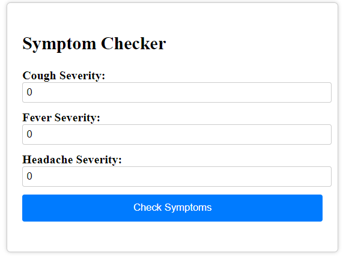

# Symptom Checker App

Welcome to the Symptom Checker App! This simple web application allows users to input symptom severities and receive a symptom severity prediction. The app is built using React for the frontend and TypeScript Node for the backend.



## Features

- Enter the severity of common symptoms: cough, fever, and headache.
- Submit the symptom data to the server.
- Receive a symptom severity prediction from the server.
- View the prediction and symptom details.

## Prerequisites

Before running the app, ensure you have the following installed:

- Node.js: Download and install Node.js from [nodejs.org](https://nodejs.org/).

## Getting Started

Follow these steps to get the Symptom Checker App up and running on your local machine:

1. Clone the repository:

   ```bash
   git clone https://github.com/your-username/symptom-checker-app.git
Navigate to the project directory:

bash
Copy code
cd symptom-checker-app
Install dependencies for the frontend and backend:

bash
Copy code
cd client
npm install
cd ../server
npm install
Start the backend server (from the server directory):

bash
Copy code
npm start
Start the React frontend development server (from the client directory):

bash
Copy code
npm start
Open your web browser and visit http://localhost:3000 to access the app.

Usage
Open the Symptom Checker App in your web browser.
Enter the severity of your symptoms:
Cough Severity: Enter a value from 0 (none) to 1 (severe).
Fever Severity: Enter a value from 0 (none) to 1 (severe).
Headache Severity: Enter a value from 0 (none) to 1 (severe).
Click the "Check Symptoms" button.
The app will send your symptom data to the server and receive a prediction.
View the prediction and symptom details on the screen.
Contributing
Contributions are welcome! If you'd like to contribute to the Symptom Checker App, please follow these guidelines:

Fork the repository.
Create a new branch for your feature or bug fix.
Make your changes and commit them with descriptive messages.
Push your changes to your fork.
Submit a pull request to the original repository.
License
This project is licensed under the MIT License. See the LICENSE file for details.

Disclaimer: This Symptom Checker App is for educational purposes only and should not be used as a substitute for professional medical advice. Always consult with a healthcare provider for accurate medical assessments.